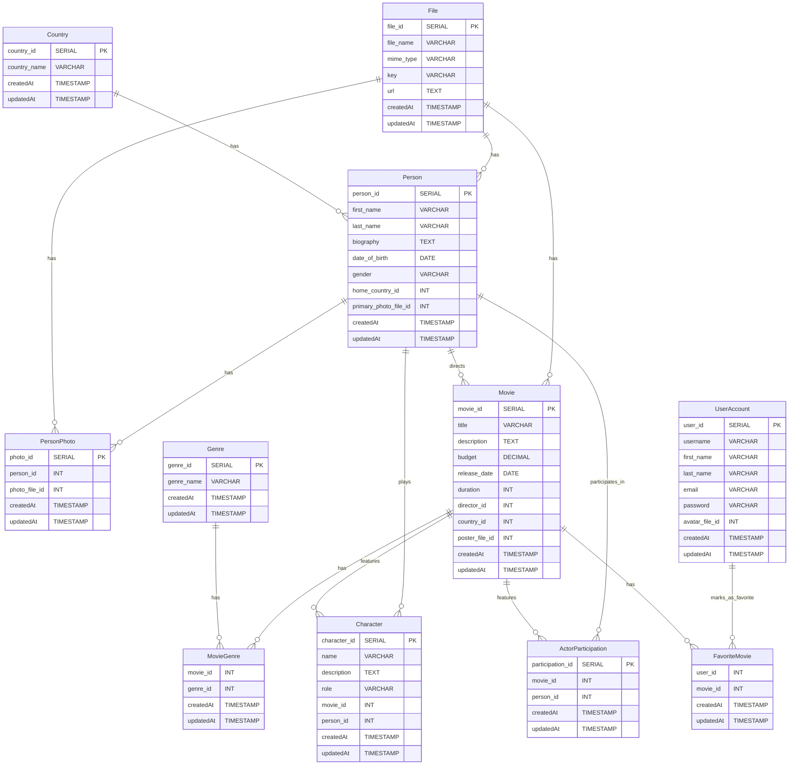

# db-and-sql

# Database Structure

## ER Diagram

```mermaid
erDiagram
    Country {
        country_id SERIAL PK
        country_name VARCHAR
        createdAt TIMESTAMP
        updatedAt TIMESTAMP
    }

    File {
        file_id SERIAL PK
        file_name VARCHAR
        mime_type VARCHAR
        key VARCHAR
        url TEXT
        createdAt TIMESTAMP
        updatedAt TIMESTAMP
    }

    Person {
        person_id SERIAL PK
        first_name VARCHAR
        last_name VARCHAR
        biography TEXT
        date_of_birth DATE
        gender VARCHAR
        home_country_id INT
        primary_photo_file_id INT
        createdAt TIMESTAMP
        updatedAt TIMESTAMP
    }

    PersonPhoto {
        photo_id SERIAL PK
        person_id INT
        photo_file_id INT
        createdAt TIMESTAMP
        updatedAt TIMESTAMP
    }

    Genre {
        genre_id SERIAL PK
        genre_name VARCHAR
        createdAt TIMESTAMP
        updatedAt TIMESTAMP
    }

    Movie {
        movie_id SERIAL PK
        title VARCHAR
        description TEXT
        budget DECIMAL
        release_date DATE
        duration INT
        director_id INT
        country_id INT
        poster_file_id INT
        createdAt TIMESTAMP
        updatedAt TIMESTAMP
    }

    ActorParticipation {
        participation_id SERIAL PK
        movie_id INT
        person_id INT
        createdAt TIMESTAMP
        updatedAt TIMESTAMP
    }

    MovieGenre {
        movie_id INT
        genre_id INT
        createdAt TIMESTAMP
        updatedAt TIMESTAMP
    }

    Character {
        character_id SERIAL PK
        name VARCHAR
        description TEXT
        role VARCHAR
        movie_id INT
        person_id INT
        createdAt TIMESTAMP
        updatedAt TIMESTAMP
    }

    UserAccount {
        user_id SERIAL PK
        username VARCHAR
        first_name VARCHAR
        last_name VARCHAR
        email VARCHAR
        password VARCHAR
        avatar_file_id INT
        createdAt TIMESTAMP
        updatedAt TIMESTAMP
    }

    FavoriteMovie {
        user_id INT
        movie_id INT
        createdAt TIMESTAMP
        updatedAt TIMESTAMP
    }

    %% Relationships
    Country ||--o{ Person : has
    File ||--o{ Person : has
    File ||--o{ PersonPhoto : has
    Person ||--o{ PersonPhoto : has
    Genre ||--o{ MovieGenre : has
    Movie ||--o{ MovieGenre : has
    Person ||--o{ Movie : directs
    File ||--o{ Movie : has
    Movie ||--o{ Character : features
    Person ||--o{ Character : plays
    Movie ||--o{ ActorParticipation : features
    Person ||--o{ ActorParticipation : participates_in
    Movie ||--o{ FavoriteMovie : has
    UserAccount ||--o{ FavoriteMovie : marks_as_favorite
```
